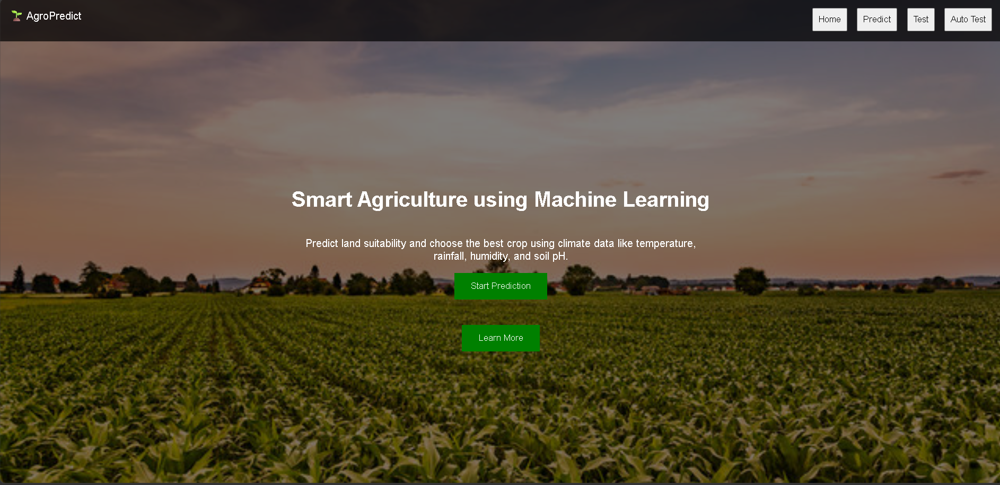
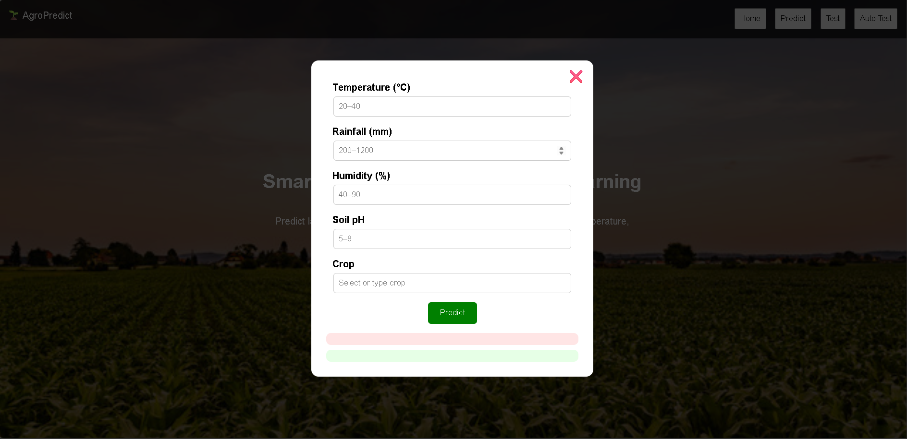

<h1 align="center">🌱 AgroPredict</h1>
<p align="center">Smart Agriculture System using Machine Learning</p>

<p align="center">
An end-to-end ML-powered application for predicting land suitability and recommending the best crop based on environmental factors such as temperature, rainfall, humidity, and soil pH.
</p>

<p align="center">


</p>

---

## 📌 About the Project

AgroPredict is a Machine Learning-based web application designed to assist farmers in making better agricultural decisions. It analyzes environmental parameters such as temperature, rainfall, humidity, and soil pH to:

✔ Determine land suitability  
✔ Recommend the best crop  
✔ Suggest alternatives if unsuitable  

---

## 🎥 Project Demo

### 🏠 Home Page


### 🤖 Prediction System


---

## 🚀 Key Features

- 🌾 Crop suitability prediction  
- 🔁 Smart crop recommendation  
- 🤖 Automated testing (random inputs)  
- 📊 Predefined test cases  
- 💻 Clean and interactive UI  

---

## 🧠 How It Works

1. User enters environmental parameters  
2. ML model processes the input  
3. System predicts suitable or alternative crop  

---

## 🧠 Models Used

| Model           | Description                                      |
|-----------------|--------------------------------------------------|
| Random Forest   | Ensemble learning algorithm for high accuracy prediction |
| Decision Tree   | Rule-based classification model for crop selection |
| Naive Bayes     | Probabilistic model for fast and efficient prediction |

---

## 📁 Project Structure
```bash
project/
├── app.py
├── model.pkl
├── train_model.py
│
├── datasets/
│ ├── Crop_recommendation.csv
│ ├── pesticides.csv
│ └── city_temperature.csv (not uploaded)
│
├── modules/
│ ├── init.py
│ ├── predict.py
│ ├── auto_test.py
│ └── pre_test.py
│
├── templates/
│ └── home.html
│
├── static/
│ └── farm.jpg
```

---

## ⚙️ Installation

```bash
git clone https://github.com/kalaigarmukhtarahmed/AgroPredict-ML.git
cd AgroPredict-ML
pip install flask pandas scikit-learn numpy
python app.py
Then open in browser:
http://127.0.0.1:5000/
```
---
📊 Dataset
```bash
The model is trained using agricultural and environmental datasets including:

🌡️ Temperature data
🌧️ Rainfall data
💧 Humidity levels
🧪 Soil pH values
🌾 Crop recommendation dataset

⚠️ Dataset is not included due to GitHub size limitations.
```
---
## 🔄 Workflow
```bash
- Data collection from agricultural datasets  
- Data preprocessing and cleaning  
- Feature selection (temperature, rainfall, humidity, pH)  
- Model training using Machine Learning algorithms  
- Prediction of suitable crop  
- Recommendation of alternative crop if not suitable  
- Integration with Flask web application
```
---

📈 Results
```bash
✔ Accurate crop prediction based on input conditions
✔ Real-time recommendation system
✔ User-friendly web interface
✔ Improved decision-making for farmers
```
---
🛠️ Tech Stack
```bash
## 🛠️ Tech Stack

- 🐍 Python  
- 🌐 Flask  
- 🤖 Scikit-learn  
- 🎨 HTML, CSS, JavaScript  
```
---
👨‍💻 Author

Kalaigar Mukhtar Ahmed 🎓 Engineering Student | Web Developer

🏁 Conclusion
This project demonstrates the practical application of Machine Learning in modern agriculture, enabling intelligent crop selection and improving decision-making for farmers.
---
